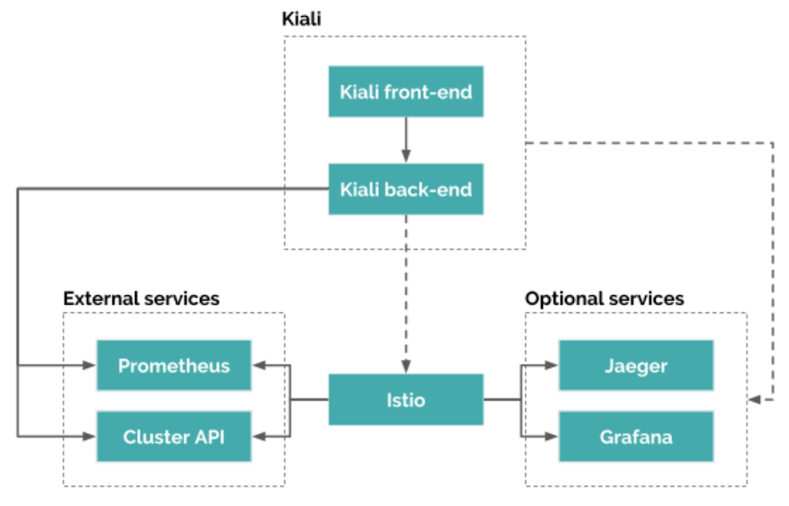
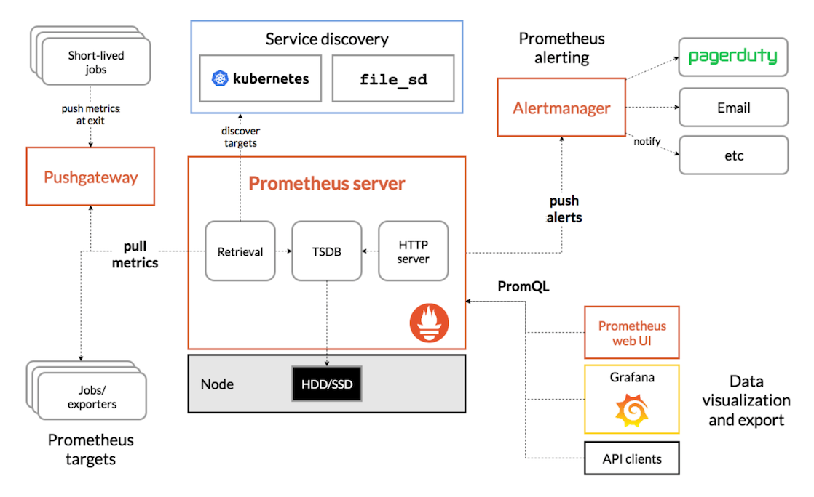
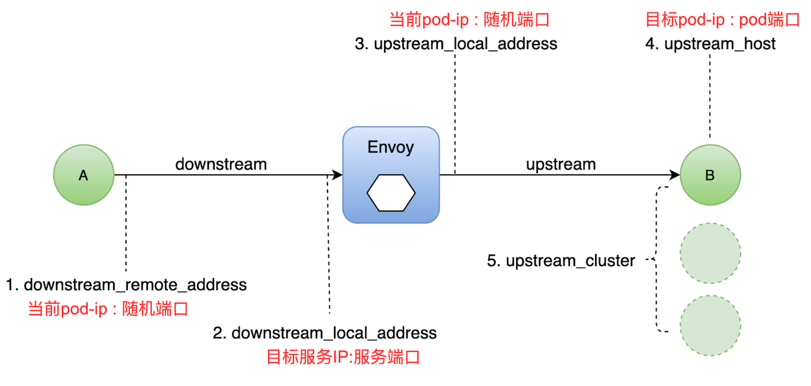

# Istioctl

## Overview


## Setup istio in docker-desktop
Details: https://istio.io/latest/docs/setup/getting-started/

1. Download istio

    ```
    curl -L https://istio.io/downloadIstio | sh -
    ```

2. Copy istioctl to env path

    ```
    cp istio-1.10.3/bin/istioctl /usr/local/bin/
    ```

3. Initialize istioctl via demo config profile

    ```
    istioctl install --set profile=demo -y
    OR
    istioctl manifest generate > ./generated-manifest.yaml
    kubectl apply -f ./generated-manifest.yaml
    ```

4. Deploy all addons integrated with istio(probably need run twice)

    ```
    kubectl apply -f istio-1.10.3/samples/addons
    ```
    More details: [README.md](istio-1.10.3/samples/addons/README.md)

5. Check crd and api resource.

    ```
    $ kubectl get crd | grep istio
    authorizationpolicies.security.istio.io    2021-08-07T13:45:19Z
    destinationrules.networking.istio.io       2021-08-07T13:45:19Z
    envoyfilters.networking.istio.io           2021-08-07T13:45:19Z
    gateways.networking.istio.io               2021-08-07T13:45:19Z
    istiooperators.install.istio.io            2021-08-07T13:45:19Z
    peerauthentications.security.istio.io      2021-08-07T13:45:19Z
    requestauthentications.security.istio.io   2021-08-07T13:45:19Z
    serviceentries.networking.istio.io         2021-08-07T13:45:19Z
    sidecars.networking.istio.io               2021-08-07T13:45:19Z
    telemetries.telemetry.istio.io             2021-08-07T13:45:19Z
    virtualservices.networking.istio.io        2021-08-07T13:45:19Z
    workloadentries.networking.istio.io        2021-08-07T13:45:20Z
    workloadgroups.networking.istio.io         2021-08-07T13:45:20Z

    $ kubectl api-resources | grep istio
    istiooperators                    iop,io       install.istio.io/v1alpha1              true         IstioOperator
    destinationrules                  dr           networking.istio.io/v1beta1            true         DestinationRule
    envoyfilters                                   networking.istio.io/v1alpha3           true         EnvoyFilter
    gateways                          gw           networking.istio.io/v1beta1            true         Gateway
    serviceentries                    se           networking.istio.io/v1beta1            true         ServiceEntry
    sidecars                                       networking.istio.io/v1beta1            true         Sidecar
    virtualservices                   vs           networking.istio.io/v1beta1            true         VirtualService
    workloadentries                   we           networking.istio.io/v1beta1            true         WorkloadEntry
    workloadgroups                    wg           networking.istio.io/v1alpha3           true         WorkloadGroup
    authorizationpolicies                          security.istio.io/v1beta1              true         AuthorizationPolicy
    peerauthentications               pa           security.istio.io/v1beta1              true         PeerAuthentication
    requestauthentications            ra           security.istio.io/v1beta1              true         RequestAuthentication
    telemetries                       telemetry    telemetry.istio.io/v1alpha1            true         Telemetry
    ```

6. Confirm the installation

    - Check via manifest
    
    ```
    istioctl verify-install -f ./generated-manifest.yaml
    ```

    - Check via dashboard
    ```
    istioctl dashboard kiali
    ```

## Demo(bookinfo)


1. Inject sidecar

    ```
    kubectl label namespace default istio-injection=enabled --overwrite=true
    ```

2. Deploy bookinfo

    ```
    kubectl apply -f istio-1.10.3/samples/bookinfo/platform/kube/bookinfo.yaml
    ```

3. Create Ingress gateway

    ```
    kubectl apply -f istio-1.10.3/samples/bookinfo/networking/bookinfo-gateway.yaml
    ```

4. Visit bookinfo

    ```
    curl http://localhost/productpage
    ```

5. Change traffic route to v1 only

    ```
    kubectl apply -f istio-1.10.3/samples/bookinfo/networking/virtual-service-all-v1.yaml
    kubectl apply -f istio-1.10.3/samples/bookinfo/networking/destination-rule-all.yaml
    ```

6. Change traffic route to v2 only
    ```
    kubectl apply -f istio-1.10.3/samples/bookinfo/networking/virtual-service-all-v2.yaml
    kubectl apply -f istio-1.10.3/samples/bookinfo/networking/destination-rule-all.yaml
    ```

7. Expose details via gateway.
    ```
    # Allow any domains to access
    kubectl apply -f istio-1.10.3/samples/bookinfo/networking/details-gateway.yaml
    # Check details output
    curl localhost/details/0
    # Check health output
    curl localhost/health
    ```
    ```
    # Only allow details.example.com to access
    kubectl apply -f istio-1.10.3/samples/bookinfo/networking/details-gateway-custom-host.yaml
    # Check details output
    curl --header "host: details.example.com" localhost/details/0
    # Check health output
    curl --header "host: details.example.com" localhost/health
    ```

8. Registry `httpbin` as internal serice in Mesh via ServiceEntry
    - Add sleep service to act as curl
        ```
        kubectl apply -f istio-1.10.3/samples/sleep/sleep.yaml
        ```
    
    - Visit external `httpbin.org` site to test if it is accessable
        ```
        kubectl exec -it sleep-557747455f-lktr5 -c sleep curl http://httpbin.org/headers
        {
            "headers": {
                "Accept": "*/*",
                "Host": "httpbin.org",
                "User-Agent": "curl/7.78.0-DEV",
                "X-Amzn-Trace-Id": "Root=1-611fb2b9-0c35890f1f2b65c1051eff72",
                "X-B3-Sampled": "0",
                "X-B3-Spanid": "56749a32650e0108",
                "X-B3-Traceid": "1ec3b070b77a3ecf56749a32650e0108",
                "X-Envoy-Attempt-Count": "1",
                "X-Envoy-Peer-Metadata": "ChkKDkFQUF9DT05UQUlORVJTEgcaBXNsZWVwChoKCkNMVVNURVJfSUQSDBoKS3ViZXJuZXRlcwoZCg1JU1RJT19WRVJTSU9OEggaBjEuMTAuMwrfAQoGTEFCRUxTEtQBKtEBCg4KA2FwcBIHGgVzbGVlcAoZCgxpc3Rpby5pby9yZXYSCRoHZGVmYXVsdAohChFwb2QtdGVtcGxhdGUtaGFzaBIMGgo1NTc3NDc0NTVmCiQKGXNlY3VyaXR5LmlzdGlvLmlvL3Rsc01vZGUSBxoFaXN0aW8KKgofc2VydmljZS5pc3Rpby5pby9jYW5vbmljYWwtbmFtZRIHGgVzbGVlcAovCiNzZXJ2aWNlLmlzdGlvLmlvL2Nhbm9uaWNhbC1yZXZpc2lvbhIIGgZsYXRlc3QKGgoHTUVTSF9JRBIPGg1jbHVzdGVyLmxvY2FsCiAKBE5BTUUSGBoWc2xlZXAtNTU3NzQ3NDU1Zi1sa3RyNQoWCglOQU1FU1BBQ0USCRoHZGVmYXVsdApJCgVPV05FUhJAGj5rdWJlcm5ldGVzOi8vYXBpcy9hcHBzL3YxL25hbWVzcGFjZXMvZGVmYXVsdC9kZXBsb3ltZW50cy9zbGVlcAoXChFQTEFURk9STV9NRVRBREFUQRICKgAKGAoNV09SS0xPQURfTkFNRRIHGgVzbGVlcA==",
                "X-Envoy-Peer-Metadata-Id": "sidecar~10.1.0.94~sleep-557747455f-lktr5.default~default.svc.cluster.local"
            }
        }
        ```

    - Disable `ALLOW_ANY` access in outbound Traffic (outboundTrafficPolicy=REGISTRY_ONLY)
        ```
        istioctl manifest generate --set meshConfig.outboundTrafficPolicy.mode=REGISTRY_ONLY --set meshConfig.accessLogFile=/dev/stdout --set meshConfig.accessLogEncoding=JSON --set meshConfig.enableTracing=true > ./generated-manifest.yaml
        kubectl apply -f ./generated-manifest.yaml
        ```
    - Check the accessiability again
        ```
        kubectl exec -it sleep-557747455f-lktr5 -c sleep curl http://httpbin.org/headers
        # No more output refers the global traffic setting blocks all outbound access.
        ```
    - Create `ServiceEntry` to allow the outbound traffic for `httpbin.org`
        ```
        kubectl apply -f istio-1.10.3/samples/bookinfo/networking/service-entry-httpbin.yaml
        ```
    - Check whether the accessiability is back.
        ```
        kubectl exec -it sleep-557747455f-lktr5 -c sleep curl http://httpbin.org/headers
        {
            "headers": {
                "Accept": "*/*",
                "Host": "httpbin.org",
                "User-Agent": "curl/7.78.0-DEV",
                "X-Amzn-Trace-Id": "Root=1-611fb2b9-0c35890f1f2b65c1051eff72",
                "X-B3-Sampled": "0",
                "X-B3-Spanid": "56749a32650e0108",
                "X-B3-Traceid": "1ec3b070b77a3ecf56749a32650e0108",
                "X-Envoy-Attempt-Count": "1",
                "X-Envoy-Peer-Metadata": "ChkKDkFQUF9DT05UQUlORVJTEgcaBXNsZWVwChoKCkNMVVNURVJfSUQSDBoKS3ViZXJuZXRlcwoZCg1JU1RJT19WRVJTSU9OEggaBjEuMTAuMwrfAQoGTEFCRUxTEtQBKtEBCg4KA2FwcBIHGgVzbGVlcAoZCgxpc3Rpby5pby9yZXYSCRoHZGVmYXVsdAohChFwb2QtdGVtcGxhdGUtaGFzaBIMGgo1NTc3NDc0NTVmCiQKGXNlY3VyaXR5LmlzdGlvLmlvL3Rsc01vZGUSBxoFaXN0aW8KKgofc2VydmljZS5pc3Rpby5pby9jYW5vbmljYWwtbmFtZRIHGgVzbGVlcAovCiNzZXJ2aWNlLmlzdGlvLmlvL2Nhbm9uaWNhbC1yZXZpc2lvbhIIGgZsYXRlc3QKGgoHTUVTSF9JRBIPGg1jbHVzdGVyLmxvY2FsCiAKBE5BTUUSGBoWc2xlZXAtNTU3NzQ3NDU1Zi1sa3RyNQoWCglOQU1FU1BBQ0USCRoHZGVmYXVsdApJCgVPV05FUhJAGj5rdWJlcm5ldGVzOi8vYXBpcy9hcHBzL3YxL25hbWVzcGFjZXMvZGVmYXVsdC9kZXBsb3ltZW50cy9zbGVlcAoXChFQTEFURk9STV9NRVRBREFUQRICKgAKGAoNV09SS0xPQURfTkFNRRIHGgVzbGVlcA==",
                "X-Envoy-Peer-Metadata-Id": "sidecar~10.1.0.94~sleep-557747455f-lktr5.default~default.svc.cluster.local"
            }
        }
        ```

9. Canary release via `VirtualService`
    ```
    kubectl apply -f istio-1.10.3/samples/bookinfo/networking/virtual-service-reviews-50-v3.yaml
    ```
    ```
    # Route to v2 version if browser is Chrome
    kubectl apply -f istio-1.10.3/samples/bookinfo/networking/virtual-service-reviews-50-v2-chrome.yaml
    ```

10. Setup ingress for `httpbin`
    ```
    # Deploy httpbin
    kubectl apply -f istio-1.10.3/samples/httpbin/httpbin.yaml
    # Deploy Gateway for httpbin
    kubectl apply -f istio-1.10.3/samples/httpbin/httpbin-gateway.yaml
    # Test interface /status
    curl -I -H host:httpbin.example.com http://localhost/status/200
    # Test interface /delay
    curl -I -H host:httpbin.example.com http://localhost/delay/5
    ```

11. Registry `httpbin` as internal serice in Mesh via `egress`

    
    ```
    # Check wheather egress exists
    kubectl get pods -n istio-system |grep egress
    istio-egressgateway-5547fcc8fc-24ckx    1/1     Running   0          104m

    # Apply serviceEntry for egress
    kubectl apply -f istio-1.10.3/samples/bookinfo/networking/service-entry-httpbin-egress.yaml

    # Get ip from outside httpbin
    kubectl exec -it sleep-557747455f-l8jwc -c sleep curl http://httpbin.org/ip
    # No more outcome

    # Config egressgateway and virtualservice
    kubectl apply -f istio-1.10.3/samples/bookinfo/networking/egress-gateway.yaml

    # Deploy DestinationRule
    kubectl apply -f istio-1.10.3/samples/bookinfo/networking/destination-rule-egress.yaml

    # Check egressgateway log
    kubectl logs -n istio-system istio-egressgateway-5547fcc8fc-24ckx -f

    # Use `sleep` to curl
    kubectl exec -it sleep-557747455f-l8jwc -c sleep curl http://httpbin.org/ip
    {
    "origin": "x.x.x.x, x.x.x.x"
    }
    ```

12. Timeout retry: improve the robustness and availability of the system

    

    ```
    # Route review to v2 version
    kubectl apply -f istio-1.10.3/samples/bookinfo/networking/virtual-service-reviews-v2.yaml

    # Ratings retry(2s latency)
    kubectl apply -f istio-1.10.3/samples/bookinfo/networking/virtual-service-ratings-retry.yaml

    # Visit productpage where ratings has 2s latency and 2 attempts
    curl http://localhost/productpage

    # Review 1s timeout
    kubectl apply -f istio-1.10.3/samples/bookinfo/networking/virtual-service-review-timeout.yaml

    # Visit productpage where review has 1s timeout, but since ratings has 2s latency, it would have internal unavailability.
    curl http://localhost/productpage

    # Check if any logs print ratings performs 2 attempts
    kubectl logs -f ratings-v1-b6994bb9-l4j29 -c istio-proxy
    ```

13. Circuit breaking for `httpbin`

    

    ```
    # Deploy `httpbin`
    kubectl apply -f istio-1.10.3/samples/httpbin/httpbin.yaml

    # Add curcuit breaking for `httpbin`
    kubectl apply -f istio-1.10.3/samples/bookinfo/networking/destination-rule-circuitbreaking.yaml

    # Deploy test tool `fortio` for concurrency and retries.
    kubectl apply -f istio-1.10.3/samples/httpbin/sample-client/fortio-deploy.yaml

    # Run test via `fortio`
    FORTIO_POD=$(kubectl get pod | grep fortio | awk '{print $1}')
    kubectl exec -it "$FORTIO_POD" -c fortio -- /usr/bin/fortio load -curl http://httpbin:8000/get

    # Request 2 concurrencies and 20 times
    kubectl exec -it "$FORTIO_POD" -c fortio -- /usr/bin/fortio load -c 2 -qps 0 -n 20 -loglevel Warning http://httpbin:8000/get
    ...
    # Success request = 16 and failed request = 4 refers to block by curcuit breaking.
    Code 200 : 16 (80.0 %)
    Code 503 : 4 (20.0 %)
    ...

    # Request 3 concurrencies and 30 times
    kubectl exec -it "$FORTIO_POD" -c fortio -- /usr/bin/fortio load -c 3 -qps 0 -n 30 -loglevel Warning http://httpbin:8000/get
    ...
    # Success request = 15 and failed request = 15 refers to block by curcuit breaking.
    Code 200 : 15 (50.0 %)
    Code 503 : 15 (50.0 %)
    ...

    # Check overflow(curcuit breaking) times
    kubectl exec $FORTIO_POD -c istio-proxy -- pilot-agent request GET stats | grep httpbin.default | grep pending
    ...
    cluster.outbound|8000||httpbin.default.svc.cluster.local.upstream_rq_pending_overflow: 19
    ...

    ```

14. Add a latency issue for ratings to simulate `Chaos engineering`

    

    Chaos engineering is to deliberately destroy the system to improve the system's reliability to respond to failures

    Istio has `fault` in `VirtualService` to simulate Chaos engineering.

    Fault has `delay` and `abort` feature to simulate failure.
    - Delay: Add service abnormal latency
    - Abort: Add service `404` `500` status code

    ```
    # Revert all virtual service to v1
    kubectl apply -f istio-1.10.3/samples/bookinfo/networking/virtual-service-all-v1.yaml

    # Route review virtual service to v2 when login as `jason`, otherwise route to v1
    kubectl apply -f istio-1.10.3/samples/bookinfo/networking/virtual-service-reviews-test-v2.yaml

    # Add rating latency delay when login as `jason`
    kubectl apply -f istio-1.10.3/samples/bookinfo/networking/virtual-service-ratings-test-delay.yaml

    # Visit `localhost/productpage` which reflects review section has unavailability issue if latency has 7s delay when login as `jason`, signout would recover.

    ```

15. Traffic mirroring

    ```
    # Deploy httpbin-v1
    kubectl apply -f istio-1.10.3/samples/traffic-mirroring/httpbin-v1.yaml

    # Deploy httpbin-v2
    kubectl apply -f istio-1.10.3/samples/traffic-mirroring/httpbin-v2.yaml

    # Deploy httpbin service
    kubectl apply -f istio-1.10.3/samples/traffic-mirroring/svc.yaml

    # Setup route rule for v1
    kubectl apply -f istio-1.10.3/samples/traffic-mirroring/vs.yaml

    # Call httpbin /header api
    export SLEEP_POD=$(kubectl get pods -l app=sleep -o jsonpath={.items..metadata.name})
    kubectl exec -it $SLEEP_POD -c sleep -- sh -c 'curl http://httpbin:8000/headers'

    # Mirror traffic from v1 to v2
    kubectl apply -f istio-1.10.3/samples/traffic-mirroring/mirror.yaml

    # Re-call httpbin /header api and check if logs exist both in v1 and v2
    kubectl logs -f httpbin-v1-774fb8b7d9-h8lxz -c httpbin
    ...
    127.0.0.6 - - [26/Aug/2021:14:21:14 +0000] "GET /headers HTTP/1.1" 200 527 "-" "curl/7.78.0-DEV"
    ...

    kubectl logs -f httpbin-v2-774dwagr29-h73cz -c httpbin
    ...
    127.0.0.6 - - [26/Aug/2021:14:21:14 +0000] "GET /headers HTTP/1.1" 200 567 "-" "curl/7.78.0-DEV"
    ...
    ```

16. Kiali

    
    

    - How to use

    ```
    istioctl dashboard kiali
    ```

17. Prometheus

    

    - How to use

    ```
    istioctl dashboard prometheus
    ```

18. Grafana

    - How to use

    ```
    istioctl dashboard grafana
    ```

19. Envoy(istio-proxy) logging

    

    ```
    # Check if logging is enable
    kubectl describe configmaps -n istio-system istio | grep accessLogFile
    accessLogFile: /dev/stdout

    # Check productpage logs
    kubectl logs -f productpage-v1-846bd994fb-vk4rw istio-proxy
    {"requested_server_name":null,"path":"/reviews/0","user_agent":"Mozilla/5.0 (Macintosh; Intel Mac OS X 10_15_7) AppleWebKit/537.36 (KHTML, like Gecko) Chrome/92.0.4515.131 Safari/537.36","downstream_local_address":"10.110.231.110:9080","start_time":"2021-08-29T10:19:39.660Z","protocol":"HTTP/1.1","upstream_service_time":"8","duration":8,"request_id":"6f867212-d7cf-4c68-9468-6fbc5f927335","x_forwarded_for":null,"response_flags":"-","bytes_received":0,"upstream_local_address":"10.1.0.223:34460","bytes_sent":295,"authority":"reviews:9080","connection_termination_details":null,"downstream_remote_address":"10.1.0.223:42980","upstream_host":"10.1.0.227:9080","response_code_details":"via_upstream","upstream_transport_failure_reason":null,"method":"GET","route_name":"default","upstream_cluster":"outbound|9080||reviews.default.svc.cluster.local","response_code":200}
    ```

20. Jaeger tracing

    
    
    

    - How to use

    ```
    istioctl dashboard jaeger
    ```

21. Secure discovery service(SDS)

    

    ```
    0.Check if `curl` is compiled via `LibreSSL`
    curl --version | grep "LibreSSL"
    curl 7.64.1 (x86_64-apple-darwin20.0) libcurl/7.64.1 (SecureTransport) LibreSSL/2.8.3 zlib/1.2.11 nghttp2/1.41.0

    1.Create a root certificate and private key for the service
    cd istio-1.10.3/samples/certs/
    openssl req -x509 -sha256 -nodes -days 365 -newkey rsa:2048 -subj '/O=example Inc./CN=example.com' -keyout example.com.key -out example.com.crt

    2.Create a certificate and private key for httpbin.example.com
    openssl req -out httpbin.example.com.csr -newkey rsa:2048 -nodes -keyout httpbin.example.com.key -subj "/CN=httpbin.example.com/O=httpbin organization"
    openssl x509 -req -days 365 -CA example.com.crt -CAkey example.com.key -set_serial 0 -in httpbin.example.com.csr -out httpbin.example.com.crt

    3. Create secret
    kubectl create -n istio-system secret tls httpbin-credential --key=httpbin.example.com.key --cert=httpbin.example.com.crt

    4.Define gateway and VirtualService
    cd ../../../
    kubectl apply -f istio-1.10.3/samples/certs/gateway.yaml
    kubectl apply -f istio-1.10.3/samples/certs/httpbin.yaml

    5. Request verification
    curl -iv -HHost:httpbin.example.com \
    --resolve httpbin.example.com:443:127.0.0.1 \
    --cacert istio-1.10.3/samples/certs/example.com.crt "https://httpbin.example.com:443/status/418"
    ...
    -=[ teapot ]=-

       _...._
     .'  _ _ `.
    | ."` ^ `". _,
    \_;`"---"`|//
      |       ;/
      \_     _/
        `"""`
    ```

22. MTLS

    

    ```
    # Create testaut namespace
    kubectl create ns testauth

    # Create sleep pod as client
    kubectl apply -f istio-1.10.3/samples/sleep/sleep.yaml -n testauth

    # curl httpbin via sleep without tls
    kubectl exec -it sleep-557747455f-n5nn5 -n testauth -c sleep -- curl http://httpbin.default:8000/ip
    {
    "origin": "127.0.0.6"
    }

    # Compatible mode deploy
    kubectl apply -f istio-1.10.3/samples/httpbin/peer-auth.yaml

    # curl httpbin via sleep with tls
    kubectl exec -it sleep-557747455f-n5nn5 -n testauth -c sleep -- curl http://httpbin.default:8000/ip

    {
    "origin": "127.0.0.6"
    }

    # Strict mode deploy
    kubectl apply -f istio-1.10.3/samples/httpbin/peer-auth-strict.yaml

    # Request failed while deploy strict mode
    kubectl exec -it sleep-557747455f-n5nn5 -n testauth -c sleep -- curl http://httpbin.default:8000/ip
    curl: (56) Recv failure: Connection reset by peer
    command terminated with exit code 56

    # Inject mtls for unblocking the strict mode
    kubectl apply -f <(istioctl kube-inject -f istio-1.10.3/samples/sleep/sleep.yaml) -n testauth

    # Check the result
    kubectl exec -it sleep-7cd5b59b89-fpfpx -n testauth -c sleep -- curl http://httpbin.default:8000/ip
    {
     "origin": "127.0.0.6"
    }
    ```

23. JWT authentication and authorization

    ```
    # Create namespace for jwt
    kubectl create ns testjwt

    # Authenticate mtls server and client
    kubectl apply -f <(istioctl kube-inject -f istio-1.10.3/samples/sleep/sleep.yaml) -n testjwt
    kubectl apply -f <(istioctl kube-inject -f istio-1.10.3/samples/httpbin/httpbin.yaml) -n testjwt

    # Test c/s connection
    kubectl exec $(kubectl get pod -l app=sleep -n testjwt -o jsonpath={.items..metadata.name}) -c sleep -n testjwt -- curl "http://httpbin.testjwt:8000/headers" -s -o /dev/null -w "%{http_code}"

    # Set JWT for server
    kubectl apply -f istio-1.10.3/samples/httpbin/httpbin-jwt.yaml

    # Set authorization policy for server
    kubectl apply -f istio-1.10.3/samples/httpbin/httpbin-jwt-auth.yaml

    # Check server connect via invalid and null token
    kubectl exec $(kubectl get pod -l app=sleep -n testjwt -o jsonpath={.items..metadata.name}) -c sleep -n testjwt -- curl "http://httpbin.testjwt:8000/headers" -H "Authorization: Bearer invalidToken" -s -o /dev/null -w "%{http_code}"
    401%

    kubectl exec $(kubectl get pod -l app=sleep -n testjwt -o jsonpath={.items..metadata.name}) -c sleep -n testjwt -- curl "http://httpbin.testjwt:8000/headers" -s -o /dev/null -w "%{http_code}"
    403%

    # Decode jwt
    TOKEN=$(curl https://raw.githubusercontent.com/malphi/geektime-servicemesh/master/c3-19/demo.jwt -s) && echo $TOKEN | cut -d '.' -f2 - | base64 --decode -

    # Check server connect via valid token
    kubectl exec $(kubectl get pod -l app=sleep -n testjwt -o jsonpath={.items..metadata.name}) -c sleep -n testjwt -- curl "http://httpbin.testjwt:8000/headers" -H "Authorization: Bearer $TOKEN" -s -o /dev/null -w "%{http_code}"
    200%

    ```
